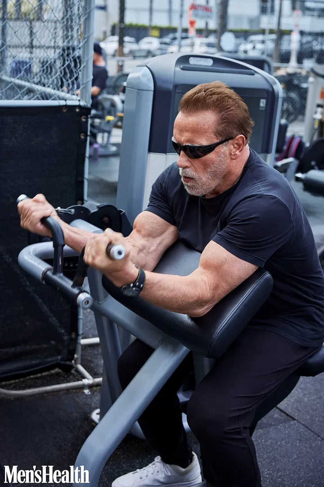

Schwarzenegger

나에겐 이론이 있다.

미래에 대한 비전이 없으면 뒤를 돌아보기가 더 쉽습니다.

비전이 없으면 오늘은 별 의미가 없습니다. 왜냐하면 지금 하고 있는 일을 왜 여기에서 하고 있는지 모르기 때문이고, 내일은 정말 무섭기 때문입니다. 어제는 비교하면 좋고 편안해 보일 수 있습니다.

그렇기 때문에 저는 여러분에게 비전을 찾으라고 계속해서 말씀드리고 싶습니다. 나는 당신이 과거에 아무것도 성취할 수 없고, 과거의 누구와도 시간을 보낼 수 없고, 행복을 찾을 수 없기 때문에 과거를 되돌아보는 사람들 중 하나가 되기를 원하지 않습니다. 과거에.

비전은 당신이 무엇을 하든 여기에 있어야 할 이유를 제공합니다. 매일 일어나서 앞으로 나아갈 수 있다는 사실이 당신을 신나게 만듭니다. 그것은 삶의 의미를 부여합니다.

귀하의 비전은 최고의 교사, 간호사, 의사, 소방관 또는 전기 기술자가 되는 것입니다. 최고의 아빠, 엄마, 조부모가 될 수도 있습니다. 가능한 한 오랫동안 가족과 함께 있을 수 있도록 신체적으로 건강해야 할 수도 있습니다. 그것은 그 모든 것들이 될 수 있습니다.

중요한 것은 그것에 대해 생각하고, 식별하고, 보는 것입니다. 오늘 잠시 시간을 내어 앉아서 ​​당신의 비전이 무엇인지 파악한 다음, 당신이 꿈꾸는 것이 무엇이든 하고 있는 자신을 시각화해보세요. 머릿속에서 영화처럼 재생해보세요.

나는 영화가 50년 전에 일어난 어떤 일보다 낫다는 것을 장담합니다.

I have a theory.

When you don’t have a vision of the future, it’s easier to look back.

When you don’t have a vision, today doesn’t have much meaning because you don’t know why you’re here doing what you’re doing right now, and tomorrow is downright scary. Yesterday can seem nice and comfortable by comparison.

This is why, over and over again, I’m going to keep telling you to find your vision. I don’t want you to be one of these people staring back into the past because you can’t accomplish anything in the past, you can’t spend time with anyone in the past, and you sure as hell can’t find happiness in the past.

A vision gives you a reason to be here, doing whatever you’re doing. It makes you excited to wake up every day and keep moving forward. It gives life meaning.

Your vision can be to be the best teacher, nurse, doctor, firefighter, or electrician you can be. It can be to be the best dad, mom, or grandparent. It can be to be physically fit so that you’re there for your family as long as possible. It can be all of those things.

All that matters is that you think about it, you identify it, and you see it. Take some time today to sit down for a few minutes, figure out what your vision is, and then visualize yourself doing whatever it is you dream of. Play it like a movie in your head.

I guarantee you that movie is better than whatever was going on 50 years ago.

https://medium.com/@Schwarzenegger/dont-look-back-1355725d01a
